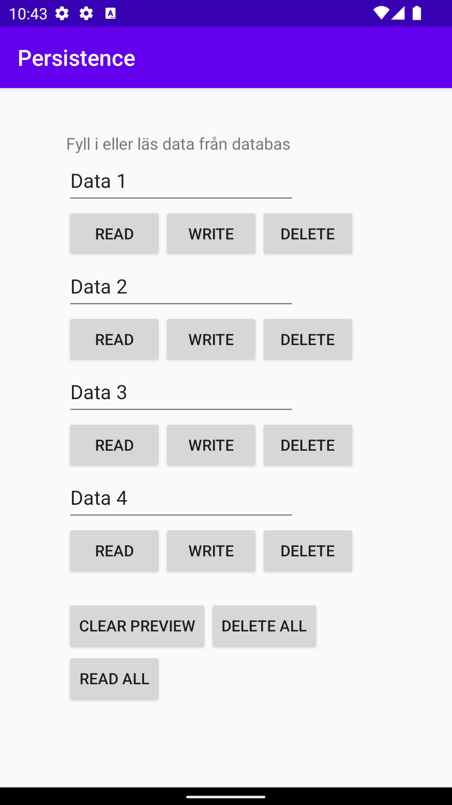

# Assignment 7: SQLite

## Layout
Applikationen består av en layout som gör det möjligt att skriva och läsa data från 4 olika datafält, bild för detta syns nedan.
De fyra olika fälten är 4 stycken EditText widgets som gör det möjligt för användaren att mata in önskat värde. Sedan finns
det en läs, skriv och radera knapp för vardera fält, och de gör precis vad det låter som. Den första läser värdet för just det specifika
fältet, den andra skriver datan från fältet till databasen och den sista raderar datan helt och hållet från bara det fältet.
Sen längst ned finns det en knapp för att radera förhandsvisningen, vilket betyder att datan töms i EditText fälten men inte från
själva databasen. Sedan finns det en som raderar hela databasen och den sista läser all data från databasen och visar den i korrekt fält.


_Figur 1.1 Bild över layout_

## Databastabell
För att bestämma vad för data som ska finnas i databastabellen skapas en egen Java klass som håller koll på detta, denna består alltså
egentligen av massa SQL queries. Den anger även konstanter som kan användas för att kallad på dessa olika nycklar. Koden för detta syns nedan:

```
class DatabaseTables {

    static class appdata {

        static final String TABLE_NAME = "appdata";
        static final String COLUMN_NAME_ID = "id";
        static final String COLUMN_NAME_TEXT = "text";

    }

    static final String SQL_CREATE_TABLE_APPDATA =
            // "CREATE TABLE mountain (id INTEGER PRIMARY KEY, name TEXT, height INT)"
            "CREATE TABLE " + appdata.TABLE_NAME + " (" +
                    appdata.COLUMN_NAME_ID + " INTEGER PRIMARY KEY," +
                    appdata.COLUMN_NAME_TEXT + " TEXT)";

    static final String SQL_DELETE_TABLE_APPDATA =
            // "DROP TABLE IF EXISTS mountain"
            "DROP TABLE IF EXISTS " + appdata.TABLE_NAME;

}
```
_Figur 2.1 kod för databastabell_

## Databashjälpare/SQLiteOpenHelper
För att kunna hantera databasen skapas något som kallas databashjälpare som också kopplas med SQLiteOpenHelper vilket just är ett verktyg för att hantera SQLite databaser,
som är den typ av databas som används i denna applikationen. Databasen är lite och kräver inte mycket prestanda och utgörs i princip av en lokal fil.
Databashjälparen gör det möjligt att bland annat skapa metoder som bygger eller raderar databasen. Det är även här namnet på databasen (filen) beskrivs, denna Java
klass är alltså kärnan för att kontrollera databasen. Kod för detta syns nedan:

```
public class DatabaseHelper extends SQLiteOpenHelper {

    private static final int DATABASE_VERSION = 1; // If this is incremented onUpgrade() will be executed
    private static final String DATABASE_NAME = "appdata.db"; // The file name of our database

    DatabaseHelper(Context context) {
        super(context, DATABASE_NAME, null, DATABASE_VERSION);
    }

    // This method is executed only if there is not already a database in the file `Mountain.db`
    @Override
    public void onCreate(SQLiteDatabase sqLiteDatabase) {
        sqLiteDatabase.execSQL(DatabaseTables.SQL_CREATE_TABLE_APPDATA);
    }

    // This method is executed only if the database version has changed, e.g. from 1 to 2
    @Override
    public void onUpgrade(SQLiteDatabase sqLiteDatabase, int oldVersion, int newVersion) {
        sqLiteDatabase.execSQL(DatabaseTables.SQL_DELETE_TABLE_APPDATA);
        onCreate(sqLiteDatabase);
    }

}
```
_Figur 3.1 kod för databashjälparen_

## Styra databasen
För att läsa skriva eller kontakta databasen skapas kopplingen i detta fallet i MainActivity. Här instansieras databasen med hjälp av denna syntax:
```
        databaseHelper = new DatabaseHelper(this);
        database = databaseHelper.getWritableDatabase();
```
_Figur 4.1 syntax för att instansera databasen_

### Lägg till data i databsen
Sedan kommer man att kunna kalla på variabeln database för att utföra en mängd olika saker mot databasen. Bland annat innehåller denna applikation en metod för att
lägga till data i databasen på en specifik tupel med hjälp av ett id, detta syns i kod nedan (figur 4.2). Genom att lägga till den önskade datan i en variabel som heter
values kan denna sedan matas in i en SQL queries.

```
    // Lägger till data med specifikt id
    private void addAppData(String text, int id) {
        ContentValues values = new ContentValues();
        values.put(DatabaseTables.appdata.COLUMN_NAME_ID, id);
        values.put(DatabaseTables.appdata.COLUMN_NAME_TEXT, text);
        database.insert(DatabaseTables.appdata.TABLE_NAME, null, values);
    }
```
_Figur 4.2 metod för att lägga till data i databasen_

### Uppdatera data i databasen
Det finns en liknande metod för att uppdatera innehållet i en specifik tupel som syns i koden nedan (figur 4.3). Ända skillnaden är att syntaxen update används istället för
insert.

```
    // Uppdaterar specifik tupel med data
    private void updateAppData(String text, String[] updateId) {
        ContentValues values = new ContentValues();
        values.put(DatabaseTables.appdata.COLUMN_NAME_TEXT, text);
        database.update(DatabaseTables.appdata.TABLE_NAME, values, "id = ?", updateId);
    }
```
_Figur 4.3 metod för att uppdatera data i specifik tupel_

### Läsa data från databasen
Sedan finns det också en metod som gör det möjligt att läsa data från databasen, kod för detta syns nedan i figur 4.4. Vad som händer är att en så kallad cursor
skapas som kan efterlikna musen i en terminal. I detta fallet så gör while loopen att den bläddrar mellan alla raderna tills det inte finns någon mer rad. Och värdet
för just nyckeln text sätts in i en ArrayList som är en global variabel och gör det möjligt för andra funktioner att hämta upp denna array för att se vilken data
som finns i databasen.

```
    // Hämtar data från databas och lägger det i en arraylist
    private void getAppData() {
        Cursor cursor = database.query(DatabaseTables.appdata.TABLE_NAME, null, null, null, null, null, null);
        appDataArray = new ArrayList();
        while (cursor.moveToNext()) {
            AppData appData = new AppData(
                    cursor.getLong(cursor.getColumnIndexOrThrow(DatabaseTables.appdata.COLUMN_NAME_ID)),
                    cursor.getString(cursor.getColumnIndexOrThrow(DatabaseTables.appdata.COLUMN_NAME_TEXT))
            );
            appDataArray.add(appData.getText());
        }
        cursor.close();
    }
```
_Figur 4.4 kod för att läsa från databasen_

Nedan är ett exempel på den kod som används för att visa datan från databasen. Som beskrevs tidigare läggs databsen värden i en array för att det ska vara möjligt
att enkelt visa innehållet. Sedan kallas denna array och just ett specifik index för att sedan visa sträng värdet av denna i EditText fältet.

```
        // Om click listner för att läsa fält hämtas detta från ArrayList
        if(view == readField1){
            getAppData();
            dataField1.setText((String) appDataArray.get(0));
        }
```
_Figur 4.5 kod för att visa databas värdet i EditText_

## Click listners
Som beskrivs först i rapporten finns en layout med knappar för att läsa och skriva till databasen. Men för att denna layout ska fungera så behöver dessa knappar
kopplas till ett antal click listners som gör det möjligt att övervaka knappen ifall att någon trycker på det och då göra andra saker. Men eftersom det är så många click
listners som måste skapas instansieras först alla click listners som syns nedan i figur 5.1 för att sedan i figur 5.2 välja vad som ska hända när de triggas.

```
        // Skapar flera click listners för att använda i if funktion nedan
        readField1.setOnClickListener((View.OnClickListener) this);
        writeField1.setOnClickListener((View.OnClickListener) this);

        readField2.setOnClickListener((View.OnClickListener) this);
        writeField2.setOnClickListener((View.OnClickListener) this);
```
_Figur 5.1 instansera click listners_

```
    @Override
    public void onClick(View view) {
        // Om click listner för att läsa fält hämtas detta från ArrayList
        if(view == readField1){
            getAppData();
            dataField1.setText((String) appDataArray.get(0));
        }

        else if(view == readField2){
            getAppData();
            dataField2.setText((String) appDataArray.get(1));
        }
        (..)
    }
```
_Figur 5.2 kod som triggas av click listners_

Video som illusterar appens funktion:
